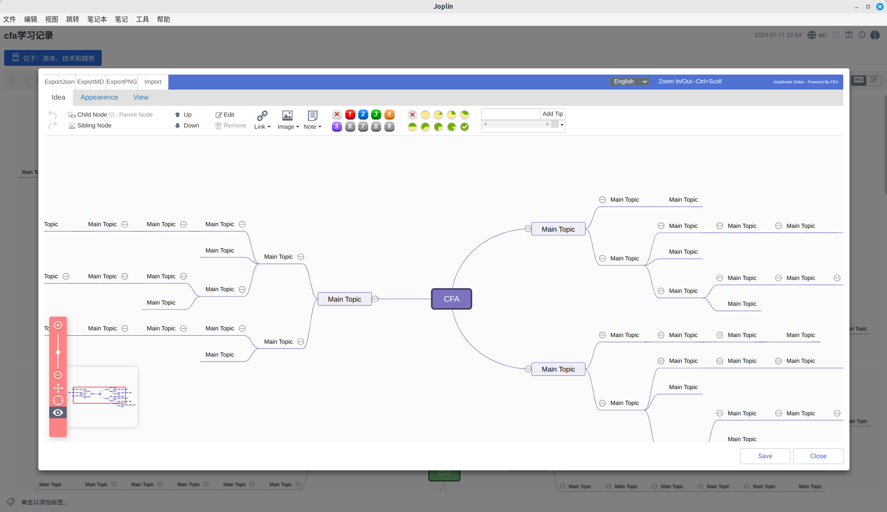

# Kityminder Mindmap Joplin Plugin



Kityminder Mindmap Joplin Plugin is a Joplin mind map plug-in built on Baidu Brain Map's open source project Kity Minder.

Forked from xeden3's joplin-plugin-kity-minder project and made several modifications:

    1.Adjusted part of the UI to make it more in line with operating habits.

    2.Re-added the import and export functions of local-kity-minder and fixed some bugs.

    3.i18n now supports English, 中文, 日本語, Español, Français and Deutsch. 
    
    4.Supports switching between different languages.

    5.Removed Baidu image searching function and internationalized all text. 

In the future, multilingual switching, uploading of local images and other functions will be realized.

Thanks to the following teams and individuals for their excellent work:

FEX team and Kity Minder's open source project [kity-minder](https://github.com/fex-team/kityminder-editor.git)

wythe0102provided the localized Kity Minder project [local-kity-minder](https://github.com/wythe0102/local-kity-minder)

xeden3's Joplin plug-in project [joplin-plugin-kity-minder] build this project foundation(https://github.com/xeden3/joplin-plugin-kity-minder)

## Build Setup

```bash
git clone https://github.com/calandradas/Kityminder-Mindmap-Joplin-Plugin.git
npm install -g yo
npm install -g generator-joplin
yo joplin --update
npm run dist
```

Then follow the second step of the installation from file.

## Installation from file

1.Download the latest version of calandra.kityminder.joplin.zip file from https://github.com/calandradas/Kityminder-Mindmap-Joplin-Plugin/releases and uncompress it.

2.Open Joplin's "Tools->Options->Plugins" menu, click on "Manage your plugins", select "Install from file", and select the corresponding calandra.kityminder.joplin.jpl to install it.

## Installation by searching

1.Open Joplin's "Tools->Options->Plugins" menu, and enter the keyword mind in the search box.

2.Select calandra.kityminder to install it.

## how to use Kityminder Mindmap Plugin

After the installation is complete, create a new note, and a brain icon will appear in the upper right corner of Joplin. Click it to enter the mind map editing mode. To edit an existing mindmap, you need to be in markdown mode. When the mouse is placed on the mindmap, an Edit icon will appear. Click it to enter the mind map editing mode.

List of commonly used shortcut keys:
|   Key  |  Performing   |
| --- | --- |
|tab  | New Child Item  |
|shift+tab |New Parent Item|
|enter |New Sibling Item|
|alt+up  | Up Item|
|alt+down  | Down Item|
|ctrl+scroll |Zoom In/Out|
|ctrl+c/ctrl+v |Copy/New Child|
|ctrl+z/ctrl+y |Undo/Redo|

Other shortcut keys can be seen by right-clicking on items.

----

## Kityminder Mindmap Joplin Plugin介绍

Kityminder Mindmap Joplin Plugin基于百度脑图的开源项目Kity Minder构建的Joplin思维导图插件；

从xeden3的joplin-plugin-kity-minder项目fork,做了功能提升:

    1.调整了部分UI，看起来更符合操作习惯。

    2.把local-kity-minder的导入导出功能重新添加上，修了一些bug。

    3.多语言国际化现在支持英语、中文、日语、西班牙语、法语、德语。
    
    4.支持多语言的切换。

    5.去掉百度搜索图片功能，将文字全部国际化。

未来将实现本地图片的上传等功能。

在此感谢以下团队和个人的优秀工作:

FEX团队和Kity Minder的开源项目[kity-minder](https://github.com/fex-team/kityminder-editor.git)

wythe0102提供的本地化Kity Minder项目[local-kity-minder](https://github.com/wythe0102/local-kity-minder)

xeden3的Joplin插件项目[joplin-plugin-kity-minder]提供的基础(https://github.com/xeden3/joplin-plugin-kity-minder)


## 编译安装

```bash
git clone https://github.com/calandradas/Kityminder-Mindmap-Joplin-Plugin.git
npm install -g yo
npm install -g generator-joplin
yo joplin --update
npm run dist
```

然后按照下面的从文件安装方式第二步操作即可

## 从文件安装

1 先通过 https://github.com/calandradas/Kityminder-Mindmap-Joplin-Plugin/releases 下载最新版本的 calandra.kityminder.joplin.zip 文件，并解压缩

2 打开Joplin的 "工具\选项\插件" 菜单，点击 "管理你的插件"，选择 "从文件安装"，选择对应的 calandra.kityminder.joplin.jpl 即可

## 通过搜索安装

1 打开Joplin的 "工具\选项\插件" 菜单，在搜索框上填入mind关键字

2 选择 calandra.kityminder 进行安装

## 使用

安装完成后，新建笔记，Joplin右上角出现一个大脑图标，点击即可进入脑图编辑模式；

编辑已有mindmap,须在markdown模式下，鼠标放到脑图上会出现Edit标志，点击即可进入脑图编辑模式。

常用快捷键列表：
|   Key  |  Performing   |
| --- | --- |
|tab  |新建Child项  |
|shift+tab |新建父级项|
|enter |新建同级项|
|alt+up  | 升级某项|
|alt+down  |降级某项|
|ctrl+scroll |放大/缩小|
|ctrl+c/ctrl+v |复制/新建子项|
|ctrl+z/ctrl+y |撤销/重做|

其他快捷键右键点击某项条目即可看到
